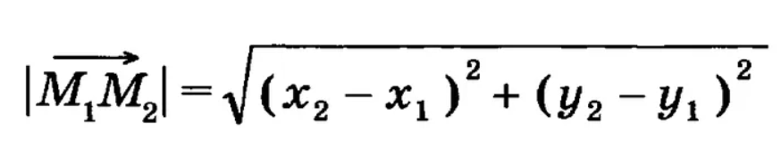

# Hi there, I'm [Nikita Uglev](https://github.com/niuglev)  
### ___Programming engineering student from Russia 🇷🇺 and this is my first documentation___
# TwoRect
### Desiption
This class uses for work with two rectangles.

### Attributes:
- x1: The x-coordinate of the first rectangle's top left corner. (int)
- y1: The y-coordinate of the first rectangle's top left corner. (int)
- x2: The x-coordinate of the first rectangle's bottom right corner. (int)
- y2: The y-coordinate of the first rectangle's bottom right corner. (int)
- x_1: The x-coordinate of the second rectangle's top left corner. (int)
- y_1: The y-coordinate of the second rectangle's top left corner. (int)
- x_2: The x-coordinate of the second rectangle's bottom right corner. (int)
- y_2: The y-coordinate of the second rectangle's bottom right corner. (int)
### Methods:
- distance_center: Calculates the distance between the centers of the two rectangles. Returns the distance as a float.
- distance_angle: Calculates the sum of the distances between the top left points and bottom right points of the two rectangles. Returns the sum as a float.
-  __init__(self, x1, y1, x2, y2, x_1, y_1, x_2, y_2)
  Initializes a TwoRect object with the given coordinates of the rectangles' corners.

### Parameters:
- x1: The x-coordinate of the first rectangle's top left corner. (int)
- y1: The y-coordinate of the first rectangle's top left corner. (int)
- x2: The x-coordinate of the first rectangle's bottom right corner. (int)
- y2: The y-coordinate of the first rectangle's bottom right corner. (int)
- x_1: The x-coordinate of the second rectangle's top left corner. (int)
- y_1: The y-coordinate of the second rectangle's top left corner. (int)
- x_2: The x-coordinate of the second rectangle's bottom right corner. (int)
- y_2: The y-coordinate of the second rectangle's bottom right corner. (int)

## distance_center(self)
Calculates and returns the distance between the centers of the two rectangles as a float with 3 sights after points.
```
Here uses math formula to find distance between two points
At fist it uses fo find center of each rectangle 
and at second to finde distance between centers
```

### Returns:
distance: The distance between the centers of the two rectangles. (float)
distance_angle(self)
Calculates and returns the distance between the centers of the two rectangles as a float with 3 sights after points.

### Exceptions:
ValueError: Raised if any of the input coordinates are not integers and return massage about exception.

### Examples:
```
two_rectangle1 = TwoRect(0, 0, 1, 1, 2, 2, 3, 3)\
result = two_rectangle1.distance_angle() -> 2.828\
```
```
two_rectangle2 = TwoRect(-1, 10, -5, -2, 109, -109, 0, -1)\
result = two_rectangle2.distance_angle() -> 82.385
```
```
two_rectangle2 = TwoRect(a, 10, b, 'sad', {}}, [], 0, -1)\
result = two_rectangle2.distance_angle() -> 'Incorrect values'
```

## distance_angle(self)
Calculates the sum of the distances between the top left points and bottom right points of the two rectangles. Returns the sum as a float with 3 sights after points.\
```
Here uses math formula to find distance between two points four times!
```

### Returns:
Calculates and returns the sum of the distances between the top left points and bottom right points of the two rectangles as a float with 3 sights after points.

### Exceptions:
ValueError: Raised if any of the input coordinates are not integers and return massage about exception.

### Examples:
```
two_rectangle1 = TwoRect(0, 0, 1, 1, 2, 2, 3, 3)\
result = two_rectangle1.distance_angle() -> 5.657
```
```
two_rectangle2 = TwoRect(-1, 10, -5, -2, 109, -109, 0, -1)\
result = two_rectangle2.distance_angle() -> 167.151
```
```
two_rectangle2 = TwoRect(a, 10, b, 'sad', {}}, [], 0, -1)\
result = two_rectangle2.distance_angle() -> 'Incorrect values'
```
## Dependencies
This program depends on the Python interpreter version 3.7 or higher, PIP 23.2.1 or higher.

### Do you enjoy this documentation?
- [x] Yes
- [ ] No